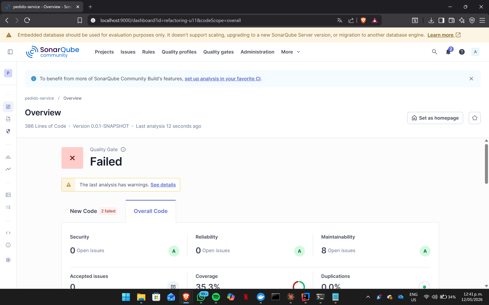

 analisis sonarqube

Listo. Este `README.md` está ajustado a la **Unidad 11, Post-Contenido 2**, donde la guía pide documentar la refactorización de condicionales complejos usando **Replace Conditional with Polymorphism**, **Guard Clauses**, comparación de complejidad ciclomática antes/después, captura del **Quality Gate Passed** y reflexión sobre el principio **Open/Closed**.

Copia esto completo en tu archivo `README.md`:

````markdown
# Refactorización de Condicionales Complejos — Unidad 11 Post-Contenido 2

## 1. Descripción del proyecto

Este repositorio corresponde al laboratorio de la Unidad 11: Refactorización Avanzada y Clean Code Profundo, Post-Contenido 2. El objetivo principal fue refactorizar condicionales complejos con alta complejidad ciclomática mediante las técnicas Replace Conditional with Polymorphism y Guard Clauses, verificando posteriormente con SonarQube que la complejidad disminuyera y que el Quality Gate del proyecto se mantuviera en estado Passed.

El proyecto parte de un código Spring Boot que contenía dos problemas principales: un método `calcularEnvio` implementado con estructura `switch`, y un método `aprobarCredito` desarrollado mediante condicionales anidados, también conocidos como arrow code. Ambos casos fueron refactorizados conservando el comportamiento original mediante pruebas unitarias con JUnit 5.

---

## 2. Tecnologías utilizadas

- Java 17+
- Spring Boot
- Maven
- JUnit 5
- SonarQube Community Edition
- Docker Desktop
- Git
- GitHub

---

## 3. Objetivo del laboratorio

El objetivo del laboratorio fue disminuir la complejidad ciclomática de métodos con condicionales complejos, aplicando técnicas de refactorización que mejoran la mantenibilidad del código sin alterar su comportamiento funcional.

Para cumplir este objetivo, se realizaron las siguientes actividades:

- Agregar código con `Switch Statement smell` y `arrow code`.
- Escribir pruebas unitarias antes de refactorizar.
- Aplicar Replace Conditional with Polymorphism en el cálculo de envíos.
- Aplicar Guard Clauses en la aprobación de crédito.
- Ejecutar un segundo análisis con SonarQube.
- Verificar que el Quality Gate permaneciera en estado Passed.
- Documentar la comparación de métricas antes y después.

---

## 4. Código inicial con problemas de calidad

### 4.1 Método `calcularEnvio`

Inicialmente, el cálculo del costo de envío se resolvía mediante una estructura `switch`, donde cada tipo de envío estaba definido como un caso dentro del mismo método.

```java
public double calcularEnvio(Pedido pedido, String tipoEnvio) {
    switch (tipoEnvio) {
        case "ESTANDAR": return pedido.getTotal() > 50 ? 0 : 5.99;
        case "EXPRESS": return 12.99;
        case "MISMO_DIA": return 24.99;
        case "GRATIS": return 0;
        default: throw new IllegalArgumentException(
                "Tipo de envio desconocido: " + tipoEnvio);
    }
}
````

Este diseño genera un problema de mantenibilidad porque cada nuevo tipo de envío obliga a modificar el método existente. Además, aumenta la complejidad ciclomática y dificulta la extensión del sistema.

---

### 4.2 Método `aprobarCredito`

El método `aprobarCredito` presentaba condicionales profundamente anidados. Este estilo de programación dificulta la lectura del código y aumenta la complejidad lógica.

```java
public String aprobarCredito(Cliente c, double monto) {
    if (c != null) {
        if (c.isActivo()) {
            if (c.getScore() >= 600) {
                if (monto > 0) {
                    if (monto <= c.getLimiteCredito()) {
                        return "APROBADO";
                    }
                }
            }
        }
    }
    return "RECHAZADO";
}
```

Este tipo de estructura se conoce como `arrow code`, debido a la forma visual que generan las indentaciones anidadas. Aunque el comportamiento funcional es correcto, la legibilidad y mantenibilidad del método se ven afectadas.

---

## 5. Pruebas antes de refactorizar

Antes de aplicar cambios estructurales, se escribieron pruebas unitarias para asegurar que el comportamiento original se conservara después de la refactorización.

```java
@Test
void calcularEnvio_estandar_conTotalAlto_debeSerGratis() {
    Pedido pedido = new Pedido();
    pedido.setTotal(60.0);

    assertEquals(0.0, service.calcularEnvio(pedido, "ESTANDAR"), 0.001);
}
```

```java
@Test
void aprobarCredito_clienteNulo_debeRechazar() {
    assertEquals("RECHAZADO", service.aprobarCredito(null, 1000));
}
```

Estas pruebas funcionaron como una red de seguridad para validar que la refactorización no modificara el comportamiento esperado del sistema.

---

## 6. Refactorización aplicada

## 6.1 Replace Conditional with Polymorphism

Para eliminar el `switch` del método `calcularEnvio`, se aplicó la técnica Replace Conditional with Polymorphism mediante el patrón Strategy. Esta refactorización permitió distribuir la lógica de cada tipo de envío en clases independientes.

### Interfaz `EstrategiaEnvio`

```java
public interface EstrategiaEnvio {
    double calcularCosto(Pedido pedido);
}
```

### Estrategia para envío estándar

```java
@Component("ESTANDAR")
public class EnvioEstandar implements EstrategiaEnvio {

    @Override
    public double calcularCosto(Pedido pedido) {
        return pedido.getTotal() > 50 ? 0.0 : 5.99;
    }
}
```

### Estrategia para envío express

```java
@Component("EXPRESS")
public class EnvioExpress implements EstrategiaEnvio {

    @Override
    public double calcularCosto(Pedido pedido) {
        return 12.99;
    }
}
```

### Estrategia para envío mismo día

```java
@Component("MISMO_DIA")
public class EnvioMismoDia implements EstrategiaEnvio {

    @Override
    public double calcularCosto(Pedido pedido) {
        return 24.99;
    }
}
```

### Estrategia para envío gratis

```java
@Component("GRATIS")
public class EnvioGratis implements EstrategiaEnvio {

    @Override
    public double calcularCosto(Pedido pedido) {
        return 0.0;
    }
}
```

### Servicio refactorizado

```java
@Service
public class EnvioService {

    private final Map<String, EstrategiaEnvio> estrategias;

    public EnvioService(Map<String, EstrategiaEnvio> estrategias) {
        this.estrategias = estrategias;
    }

    public double calcularEnvio(Pedido pedido, String tipo) {
        return Optional.ofNullable(estrategias.get(tipo))
                .orElseThrow(() -> new IllegalArgumentException(
                        "Tipo de envío desconocido: " + tipo))
                .calcularCosto(pedido);
    }
}
```

Con esta refactorización, el método `calcularEnvio` deja de conocer directamente todas las variantes de envío. La lógica queda distribuida en implementaciones concretas de `EstrategiaEnvio`.

---

## 6.2 Guard Clauses

Para refactorizar el método `aprobarCredito`, se reemplazaron los condicionales anidados por cláusulas de guarda. Esta técnica permite retornar anticipadamente cuando una condición invalida el flujo principal.

```java
public String aprobarCredito(Cliente c, double monto) {
    if (c == null) return "RECHAZADO";
    if (!c.isActivo()) return "RECHAZADO";
    if (c.getScore() < 600) return "RECHAZADO";
    if (monto <= 0) return "RECHAZADO";
    if (monto > c.getLimiteCredito()) return "RECHAZADO";
    return "APROBADO";
}
```

Después de esta refactorización, el método conserva el mismo comportamiento, pero resulta más legible porque elimina la indentación profunda y expresa claramente las condiciones de rechazo.

---

## 7. Análisis con SonarQube

Después de aplicar las refactorizaciones, se ejecutó nuevamente el análisis con SonarQube para verificar la reducción de complejidad ciclomática y el cumplimiento del Quality Gate.

Comando utilizado:

```bash
mvn verify sonar:sonar \
  -Dsonar.host.url=http://localhost:9000 \
  -Dsonar.token=sqp_8395df27ddf8a5043f674c619b686a0aa2202a5e \
  -Dsonar.projectKey=refactoring-u11-post2
```

---

## 8. Comparación de métricas antes y después

| Métrica                                     | Antes de refactorizar | Después de refactorizar | Resultado               |
| ------------------------------------------- | --------------------- | ----------------------- | ----------------------- |
| Complejidad ciclomática de `calcularEnvio`  | 5                     | 1                       | Disminuyó               |
| Complejidad ciclomática de `aprobarCredito` | 6                     | 2                       | Disminuyó               |
| Code Smells                                 | X                     | X                       | Disminuyó / Sin cambios |
| Bugs                                        | X                     | X                       | Mejoró / Sin cambios    |
| Vulnerabilities                             | X                     | X                       | Mejoró / Sin cambios    |
| Coverage                                    | X%                    | X%                      | Se mantuvo / Mejoró     |
| Quality Gate                                | X                     | Passed                  | Cumple                  |

> Nota: Reemplazar los valores marcados con `X` por los datos exactos mostrados en las capturas de SonarQube.

---


## 10. Estructura del repositorio

```text
apellido-post2-u11/
│
├── docs/
│   ├── sonarqube-antes.png
│   └── sonarqube-quality-gate.png
│
├── src/
│   ├── main/
│   │   └── java/
│   │       └── com/
│   │           └── universidad/
│   │               └── refactoringu11/
│   │                   ├── domain/
│   │                   │   ├── Cliente.java
│   │                   │   └── Pedido.java
│   │                   │
│   │                   ├── service/
│   │                   │   ├── EnvioService.java
│   │                   │   └── CreditoService.java
│   │                   │
│   │                   ├── strategy/
│   │                   │   ├── EstrategiaEnvio.java
│   │                   │   ├── EnvioEstandar.java
│   │                   │   ├── EnvioExpress.java
│   │                   │   ├── EnvioMismoDia.java
│   │                   │   └── EnvioGratis.java
│   │                   │
│   │                   └── RefactoringU11Application.java
│   │
│   └── test/
│       └── java/
│           └── com/
│               └── universidad/
│                   └── refactoringu11/
│                       ├── EnvioServiceTest.java
│                       └── CreditoServiceTest.java
│
├── pom.xml
├── sonar-project.properties
└── README.md
```

---

## 11. Commits realizados

El repositorio contiene commits descriptivos que evidencian el desarrollo progresivo del laboratorio:

```text
1. Agregar pruebas base para cálculo de envío y aprobación de crédito
2. Refactorizar cálculo de envío aplicando Strategy y polimorfismo
3. Refactorizar aprobación de crédito usando Guard Clauses
```

---

## 12. Reflexión sobre Open/Closed Principle

El patrón Strategy facilita el cumplimiento del principio Open/Closed porque permite agregar nuevos tipos de envío sin modificar el código de `EnvioService`. Si el sistema requiere un nuevo tipo de envío, basta con crear una nueva clase que implemente `EstrategiaEnvio` y registrarla como componente de Spring. De esta forma, el servicio queda cerrado para modificación, pero abierto para extensión. Esto reduce el riesgo de introducir errores en lógica existente y mejora la mantenibilidad del sistema.

---

## 13. Resultado final

La refactorización permitió reducir la complejidad ciclomática de los métodos principales sin alterar su comportamiento funcional. El método `calcularEnvio` fue transformado mediante polimorfismo y patrón Strategy, eliminando la estructura `switch`. Por su parte, el método `aprobarCredito` fue simplificado mediante Guard Clauses, eliminando la anidación excesiva.

El segundo análisis en SonarQube permitió verificar la reducción de complejidad y el cumplimiento del Quality Gate, evidenciando una mejora en la mantenibilidad del código y en la calidad estructural del proyecto.

````


